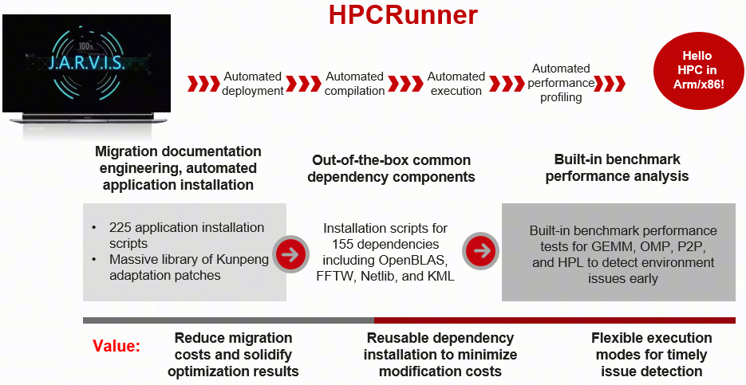

# HPCRunner Contribution Guide

The HPCRunner project welcomes your expertise and enthusiasm!

Small improvements or bug fixes are always appreciated. Updating documentation is a great place to start. If you are considering a major contribution, please open an issue or start a discussion at [HPCRunner](https://atomgit.com/openeuler/hpcrunner/issues).

Writing code is not the only way to contribute to Jarvis. You can also:

- Contribute installation scripts.
- Help test new HPC applications.
- Develop tutorials and demos.
- Spread the word about Jarvis.
- Help onboard new contributors.

## Features



- Supports Arm and x86 architectures. Uses industry-standard dependency directory structures to manage massive dependencies and automatically generate environment module files.
- One-click compilation, execution, CPU/GPU performance profiling, and benchmarking based on HPC configurations.
- Stores all settings in a single file. Deploying HPC applications to different machines only requires modifying this configuration file.
- Adopts an integrated log management system to automatically record all information during the HPC application deployment process.
- Requires no compilation and runs directly with a Python environment.
- Supported for Quantum Espresso (QE). For details, refer to the `container/` directory.
- Roadmap (future features)
  - Integration of common performance tuning methods and core algorithms in the HPC field.
  - Cluster performance analysis tools.
  - Intelligent auto-tuning.

## Code Contribution Guide

### Preparations

1. Configure the SSH key.

   ```bash
   cd ~/.ssh
   ssh-keygen
   cat id_rsa.pub
   ```

   Copy the output content and add it to your profile via **SSH Key**.

2. Configure user settings.

    ```bash
    # Ignore file mode (permission) changes.
    git config core.fileMode false
    git config --global user.name "XXX"
    git config --global user.email "XXX"
    ```

3. Fork the repository and clone your fork. The following uses `iotwins` as an example. Replace it with your actual username.

   ```bash
   git clone git@gitee.com:iotwins/hpcrunner.git
   ```

4. Link your local repository to the upstream remote.

   ```bash
   git remote add upstream git@gitee.com:openeuler/hpcrunner.git
   ```

### Code Contribution Workflow

1. Switch to the master branch and pull the latest upstream changes.

   ```bash
   git checkout master
   git pull upstream master
   ```

2. Create and switch to a new feature branch. The branch name is custom.

   ```bash
   git checkout -b new_branch
   ```

3. Make your code modifications.

4. Commit and push your changes

   ```bash
   git add .
   git commit --no-verif -m "Add XXX function"
   git push origin new_branch
   ```

5. Go to your forked repository page (for example, <https://gitee.com/iotwins/hpcrunner>) and create a Pull Request (PR).

## FAQ

### How Do I Fix an Incorrect Commit Message?

- Method 1: Using `git stash`

   If you have uncommitted changes in your workspace or staging area, use `git stash` to temporarily shelf them. This leaves you with a clean working directory to handle fixes or syncs. Afterward, restore your work using `git stash pop` to continue development.

- Method 2: Using `git rebase`
  
  Run the interactive rebase command targeting the parent commit of the one you want to modify:

  ```bash
  git rebase -i <commitID>  # Example: git rebase -i sd98dsf89sdf
  ```

  In the interactive rebase editor that opens:
  
  1. Locate the commit line you want to change.
  2. Change the command from `pick` to `edit` at the beginning of the line (you can do this for one or multiple commits).
  3. Save and close the editor.

  Depending on your goal, use `--amend` to modify the commit:
  
  - Modify the commit message only.

   ```bash
   git commit --amend
   ```

  - Modify the author and email only.

   ```bash
   git commit --amend --author="zhangsan <hello@gmail.com>" --no-edit
   ```

  - Modify the message, author, and email simultaneously.

   ```bash
   git commit --amend --author="zhangsan <hello@gmail.com>"
   ```

  Once modified, resume the rebase process:

  ```bash
  git rebase --continue
  ```

  Repeat until you see the following confirmation message, indicating the rebase is complete:
  
  ```bash
  Successfully rebased and updated xxx
  ```

- Method 3: Using `git push --force`

  To apply the rewritten history to your remote repository, force push to your branch:
  
  ```bash
  git push --force origin master 
  ```

## Developer Notes

### Using HPCKit Instead of Standalone Installations of Hyper MPI, BiSheng Compiler, and KML

Recommended approach for installing and enabling HPCKit:

```bash
./jarvis -install hpckit/${HPCKIT_VERSION} any
module use software/utils/hpckit/224.0.0/HPCKit/24.0.0/modulefiles
module purge
module load bisheng/compiler${BISHENG_VERSION}/bishengmodule bisheng/hmpi${HMPI_VERSION}/hmpi
```

Not recommended:

```bash
./jarvis -install hmpi/1.1.1 clang
module use software/moduledeps/bisheng2.1.0
module load hmpi/1.1.1
```

### Avoiding Hardcoded Absolute Paths in Development Templates

Not recommended:

```bash
export JARVIS_ROOT=/hpcrunner
```

## Technical Articles & Resources

[Demystifying HPC Applications](https://zhuanlan.zhihu.com/p/489828346)

[A Date with Containers](https://zhuanlan.zhihu.com/p/499544308)

[Jarvis: The Ultimate HPC Application Steward](https://zhuanlan.zhihu.com/p/518460349)

For more information on HPC deployment and performance optimization, please scan and join the openEuler HPC SIG WeChat Group.


