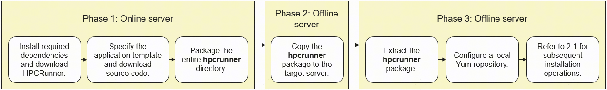

# HPCRunner: An Intelligent, One-Stop Deployment and Tuning Tool for HPC Applications


# 1 Overview

## 1.1 Overview

High-Performance Computing (HPC) is often regarded as the "crown jewel" of the IT industry, characterized by steep learning curves for deployment, compilation, execution, and performance analysis. Deploying HPC applications across heterogeneous hardware is typically time-consuming and labor-intensive. Developers frequently face the redundant burden of maintaining and validating both Arm and x86 environments simultaneously, which dilutes efforts away from core algorithm optimization.

HPCRunner addresses these challenges by delivering a unified, cross-architecture deployment framework. It streamlines multi-environment workflows and significantly boosts overall development efficiency.

## 1.2 Deployment Prerequisites & Scenarios

### 1.2.1 Network Environments

- (Recommended) Online deployment: Ensure the target server has Internet access (ping Google or GitHub). This allows the tool to automatically fetch application source packages and test cases. For installation steps, see [Section 2.1](#21-scenario-1-using-hpcrunner-on-servers-with-internet-access).

- Offline deployment: If the server is isolated from the Internet, manually download the required installation packages and upload them to the target server. For detailed steps, see [Section 2.2](#22-scenario-2-using-hpcrunner-on-servers-without-internet-access).

### 1.2.2 Execution Environment

The deployment tool automatically maps the execution environment by matching key fields in the configuration file (`.config`) name. Refer to the table below for examples.

| **Sample Config File** | **Key Field** | **Remarks** |
|--|--|--|
| data.qe.arm.cpu.config | arm | Must be executed in an Arm environment. |
| data.qe.arm-sve.cpu.config | arm-sve | Must be executed on an Arm server supporting SVE. |
| data.qe.arm.gpu.config | arm+gpu | Must be executed on an Arm server equipped with GPUs. |
| data.qe.x86.gpu.config | x86 | Must be executed on an x86 server. |
| data.qe.x86.gpu.config | x86+gpu | Must be executed on an x86 server equipped with GPUs. |

### 1.2.3 Memory and Storage Requirements

- Memory: A minimum of 32 GB of free RAM is recommended.
- Storage: Ensure the `/tmp` directory has more than 100 GB of available drive space.

### 1.2.4 OS and Kernel Requirements

- Validated environment: This tool has been fully verified for compilation and deployment on Arm servers running openEuler 22.03 LTS SP4 (Kernel 5.10).
- Other environments: To deploy on other OSs or kernel versions, modify the corresponding scripts according to your specific compilation and installation requirements.

# 2 Usage Guide

Select the appropriate workflow based on your target servers' network connectivity.

## 2.1 Scenario 1: Using HPCRunner on Servers with Internet Access

### 2.1.1 Workflow

Follow this workflow if your target server has Internet access.


### 2.1.2 Installing Dependencies

Run the following command to install required dependencies:

```bash
yum -y install git time zlib zlib-devel gcc gcc-c++ environment-modules python python3 python3-devel python3-libs python3-pip cmake make numactl numactl-devel numactl-libs rpmdevtools wget libtirpc libtirpc-devel unzip flex tar patch glibc-devel rpcbind csh perl-XML-LibXML xorg-x11-xauth curl curl-devel libcurl-devel
```

### 2.1.3 Downloading and Installing HPCRunner

Clone the repository.

```bash
git clone https://atomgit.com/openeuler/hpcrunner.git
```


### 2.1.4 Deploying an Application (Using WRF as an Example)


The following steps demonstrate how to build and install the Weather Research and Forecasting (WRF) model using HPCRunner:

1. Navigate to the `hpcrunner` directory.

    ```bash
    cd hpcrunner
    ```

2. Load environment variables and install WRF.

    ```bash
    source init.sh
    ./jarvis -use templates/wrf/4.7.1/data.wrf.arm.cpu.config 
    ./jarvis -d
    ./jarvis -dp
    ./jarvis -b
    ./jarvis -r
    ```

    For details, see [Using HPCRunner for Automated Build and Cross-Platform Installation of WRF](https://www.hikunpeng.com/zh/developer/techArticles/20251223-1).

    Note: Replace the template file path (`templates/wrf/4.7.1/data.wrf.arm.cpu.config`) based on your target software and version. For other application templates, see [templates](https://atomgit.com/openeuler/hpcrunner/tree/master/templates).

3. (Optional) Configure network proxy.

    If the online server encounters download failures, execute the `proxy.sh` script to switch download mirrors. Follow the interactive prompt to select an optimal source.

    ```bash
    ./proxy.sh
    ```

    

## 2.2 Scenario 2: Using HPCRunner on Servers without Internet Access

### 2.2.1 Workflow

Follow this workflow if your target server is isolated from the Internet.



### 2.2.2 Procedure (Using WRF as an Example)

1. On a server with Internet access, perform the following operations:

   1. Install required dependencies and download HPCRunner by following [Section 2.1.2](#212-installing-dependencies) and [Section 2.1.3](#213-downloading-and-installing-hpcrunner).

   2. Fetch all required source packages.

      Navigate to the `hpcrunner` directory, load environment variables, and specify the application template.

      ```bash
      cd hpcrunner && source init.sh && ./jarvis -use templates/wrf/4.7.1/data.wrf.arm.cpu.config
      ```

      Download the application and its dependency source code.

      ```bash
      ./jarvis -d && ./jarvis -dp
      ```

2. Copy the entire `hpcrunner` directory to the offline target server.

3. On the offline target server, perform the following operations:

   1. Log in to the target server, navigate to the storage path, and extract the package.

   2. Configure a local Yum repository.

      Since the target server cannot reach external Yum repositories, you must set up a local or internal OS package repository beforehand to install required dependencies. For detailed instructions, refer to [Configuring the Local Yum Source](https://www.hikunpeng.com/document/detail/en/kunpengdbs/ecosystemEnable/MariaDB/openmind_mariadb1039_02_0005.html).

   3. Install required dependencies by following [Section 2.1.2](#212-installing-dependencies).

   4. Install the application via HPCRunner by following [Section 2.1.4](#214-deploying-an-application-using-wrf-as-an-example).

## 3 Features

### 3.1 Repository Structure

| **Directory/File**     | **Description**                                  | **Remarks**                                                   |
|-----------|-------------------------------------|------------------------------------------------------|
| benchmark | Performance benchmarks including HPL, Stream, matrix operations, OpenMP, MPI, P2P, etc. |                                                      |
| doc       | Technical documentation.                                  |                                                      |
| downloads | Archives and source packages of dependency libraries.                        |                                                      |
| examples  | Lightweight performance micro-benchmarks.                               |                                                      |
| package   | Installation scripts and FAQs.                          |                                                      |
| software  | Software installation directory (including built-in accuracy analysis tools).                    | Automatically generated.<br>`apps/` serves as the installation path for applications.<br>For other subdirectories, see [Options](#34-options). |
| src       | Source code of HPCRunner.                               |                                                      |
| templates | Pre-configured deployment templates for mainstream HPC applications.                        |                                                      |
| test      | Test cases for HPCRunner.                             |                                                      |
| workloads | Benchmark datasets and test directories for HPC applications.                   |                                                      |
| init.sh   | HPCRunner initialization script.                            |                                                      |
| jarvis    | Entry point for HPCRunner.                             |                                                      |
| tmp       | Directory for software build and extracted source code.                    |                                                      |

### 3.2 Configuration File Reference (`.config`)

| **Section**      | **Description**                                                                                        | **Example**                                                                                                                                  |
|--------------|-----------------------------------------------------------------------------------------------|-----------------------------------------------------------------------------------------------------------------------------------------|
| [SERVER]     | Target cluster node list (one IP address per line). Used to automatically generate the `hostfile`.                                                                    | 11.11.11.11<br>22.22.22.22                                                                                                              |
| [DOWNLOAD]   | Format: `<app>/<appversion> <download_url> [alias]`<br>Note: For offline deployments, download these packages in advance and place them under `hpcrunner/downloads/`. | cp2k/8.2 https://github.com/extdomains/github.com/cp2k/cp2k/releases/download/v8.2.0/cp2k-8.2.tar.bz2                                   |
| [DEPENDENCY] | Dependencies required by an HPC application.                                                                                | ./jarvis -install gmp/6.2.0 clang<br>./jarvis -install boost/1.72.0 clang                                                               |
| [ENV]        | Environment variables required for compiling and running an HPC application.                                                                              | module use ./software/modulefiles<br>module load bisheng/3.2.0<br>module load boost/1.72.0                                              |
| [APP]        | HPC application metadata, including the application name, build path, binary path, and test case path.                                                                 | app_name = CP2K <br>build_dir = /home/cp2k-8.2/ <br>binary_dir = /home/CP2K/cp2k-8.2/bin/ case_dir = /home/CP2K/cp2k-8.2/benchmarks/QS/ |
| [BUILD]      | Build and compilation scripts for an HPC application.                                                                                     | ./configure <br>make -j<br>make install                                                                                                 |
| [CLEAN]      | Cleanup scripts used to purge build artifacts.                                                                                   | make clean                                                                                                                              |
| [RUN]        | Execution settings for an HPC application, including the runner prefix, executable commands, and node count.                                                                    | run = mpirun -np 2 <br>binary = cp2k.psmp H2O-256.inp <br>nodes = 1                                                                     |
| [JOB]        | Job scheduler settings for running an HPC application.                                                                                 | Donau Scheduler job script templates                                                                                                                                |
| [BATCH]      | Commands for batch execution.                                                                               | #!/bin/bash <br>mpirun -np 2 cp2k.psmp H2O-256.inp mpirun -np 2 cp2k.psmp H2O-512.inp                                                   |
| [PERF]       | Extra CLI flags and parameters for performance profiling. tools.                                                                                | perf= -o <br>nsys= <br>ncu=--target-processes all --launch-skip 71434 --launch-count 1                                                  |

### 3.3 Command Reference

| **Function**                | **Command**                                                                           | **Description/Examples**                                                                                                                                                                                                                                                                                                                                                                                                                                                                                                                                                                                                                                                                                      |
|-----------------------|----------------------------------------------------------------------------------|------------------------------------------------------------------------------------------------------------------------------------------------------------------------------------------------------------------------------------------------------------------------------------------------------------------------------------------------------------------------------------------------------------------------------------------------------------------------------------------------------------------------------------------------------------------------------------------------------------------------------------------------------------------------------------------------|
| Help information                  | ./jarvis -h                                                                      | Displays the help menu and CLI usage guidelines.                                                                                                                                                                                                                                                                                                                                                                                                                                                                                                                                                                                                                                                                                               |
| Active configuration templates                | ./jarvis -use /path/app.config                                                   | Sets the active configuration templates. Priority (highest to lowest):<br>1. Environment variable `JARVIS_CONFIG` (allowing multi-user parallel execution):<br>`export JARVIS_CONFIG=/path/app.config`<br>2. Explicit CLI definition:`./jarvis -use /path/app.config`<br>3. Default template: `data.config` in the root directory.                                                                                                                                                                                                                                                                                                                                                                                                                                                                                                               |
| Automated HPC application download             | ./jarvis -d                                                                      | Automatically downloads the source packages specified in the `[DOWNLOAD]` section to the `downloads/` directory.<br>Note: For offline scenarios, manually upload packages to `downloads/` prior to execution.                                                                                                                                                                                                                                                                                                                                                                                                                                                                                                                                                                                                             |
| Dependency installation                  | ./jarvis -install [package/][name/version/other] [option]                        | Targets specific dependency installation packages located in the `package/` directory (up to the parent directory of `install.sh`).<br>**Parameters:**<br>`package`: Optional.<br>`name`: Name of the software.<br>`version`: Software version.<br>`other`: Sub-version (parent directory of `install.sh`).<br>`option`: build/compiler toolchain (see below for options).<br>**Examples:**<br>1. Install the compiler toolchain.<br>`./jarvis -install hpckit/x.x.x any<br>module use xxx`<br>`module load bisheng/xxx`<br>2. Install MPI.<br>`./jarvis -install hpckit/x.x.x any`<br>`module use xxx`<br>`module load hmpi/xxx`<br>3. Install dependencies.<br>`module use software/module*`<br>`module load bisheng/x.x.x`<br>`module load hmpi/x.x.x`<br>`export CC=mpicc CXX=mpicxx FC=mpifort` <br>`./jarvis -install hdf5/1.8.20/clang bisheng+mpi`<br>4. Install the tool.<br>`./jarvis -install hpckit/2025.3.30 any`<br>`./jarvis -install go/1.18 any` |
| Dependency uninstallation                | ./jarvis -remove xxx                                                             | Supports fuzzy matching.<br>Example: `./jarvis -remove openblas/0.3.18`                                                                                                                                                                                                                                                                                                                                                                                                                                                                                                                                                                                                                                                        |
| Batch dependency installation           | ./jarvis -dp                                                                     | Automatically parses and processes all entries declared under the `[DEPENDENCY]` section of the active configuration templates in sequential order.<br>Requires executing `./jarvis -use app.config` first.                                                                                                                                                                                                                                                                                                                                                                                                                                                                                                                                                                                                                           |
| Installed software manifest            | ./jarvis -l                                                                      | Lists all successfully installed software packages using relative paths.                                                                                                                                                                                                                                                                                                                                                                                                                                                                                                                                                                                                                                                                                    |
| Software path discovery              | ./jarvis -f xxx                                                                  | Queries the installation path of a package.<br>Example: `./jarvis -f openblas`                                                                                                                                                                                                                                                                                                                                                                                                                                                                                                                                                                                                                                                            |
| Environment script generation              | ./jarvis -e                                                                      | Parses the `[ENV]` section of the `.config` file and exports an `env.sh` script. This is automatically generated and applied when running `./jarvis -b` or `./jarvis -r`.                                                                                                                                                                                                                                                                                                                                                                                                                                                                                                                                                                                                                                 |
| Automated build execution                  | ./jarvis -b                                                                      | Navigates to the path defined in `build_dir` under `[APP]`, dynamically generates a `build.sh` based on the `[BUILD]` section, and runs the build process.                                                                                                                                                                                                                                                                                                                                                                                                                                                                                                                                                                                                                                    |
| Automated workload execution                  | ./jarvis -r                                                                      | Navigates to the path defined in `case_dir` under [APP], generates a `run.sh` script using instructions from the `[RUN]` section, and executes the workload.                                                                                                                                                                                                                                                                                                                                                                                                                                                                                                                                                                                                                                      |
| Batch execution                  | ./jarvis -rb                                                                     | Navigates to the path defined in `case_dir` under `[APP]`, generates a `batch_run.sh` script using instructions from the `[BATCH]` section, and triggers execution.                                                                                                                                                                                                                                                                                                                                                                                                                                                                                                                                                                                                                              |
| CPU performance profiling             | ./jarvis -p                                                                      | Reads the `perf` option from the `[PERF]` section, then executes the perf tool to profile CPU data.                                                                                                                                                                                                                                                                                                                                                                                                                                                                                                                                                                                                                                                    |
| GPU performance profiling             | ./jarvis -gp                                                                     | Reads the `nsys` option from the `[PERF]` section, then executes the nsys tool to profile GPU data.                                                                                                                                                                                                                                                                                                                                                                                                                                                                                                                                                                                                                                                    |
| Server information output             | ./jarvis -i                                                                      | Outputs server information, including CPU, NIC, and OS details, and memory allocations.                                                                                                                                                                                                                                                                                                                                                                                                                                                                                                                                                                                                                                                                              |
| Automated server benchmarking             | ./jarvis -bench all ./jarvis -bench mpi ./jarvis -bench omp ./jarvis -bench gemm | Triggers predefined synthetic and architecture-specific benchmarks (for example, HPL, Stream, MPI, OpenMP, and P2P). Benchmarking profiles are managed in the `hpcrunner/benchmark/` directory.                                                                                                                                                                                                                                                                                                                                                                                                                                                                                                                                                                                                                              |
| Singularity container definition generation | ./jarvis -container docker-hub-address                                           | Generates a Singularity container definition file. `--docker-hub-address` specifies the base image.<br>Requires setting the active profile via `./jarvis -use data.config` first.<br>Example: `./jarvis -container openeuler/openeuler`                                                                                                                                                                                                                                                                                                                                                                                                                                                                                                                                                                             |
| Dependency path update              | ./jarvis -u                                                                      | Dynamically updates reference paths in `software/modulefiles` if the hpcrunner directory has been relocated.                                                                                                                                                                                                                                                                                                                                                                                                                                                                                                                                                                                                                                                       |

### 3.4 Options

Usage introduction for `[option]` in the `./jarvis -install [package/][name/version/other] [option]` command

| **Option**     | **Description**             | **Installation Directory**                  |
|-------------|--------------------|---------------------------|
| com         | Installs a compiler.              | software/compiler         |
| gcc         | Uses GCC for compilation.          | software/libs/gcc         |
| gcc+mpi     | Uses GCC and the currently active MPI for compilation. | software/libs/gcc-mpi     |
| bisheng     | Uses BiSheng Compiler compilation.           | software/libs/bisheng     |
| bisheng+mpi | Uses BiSheng Compiler and the currently active MPI for compilation.  | software/libs/bisheng-mpi |
| any         | Installs utilities.             | software/utils            |

# 4 Supported Software

- [Supported applications](doc/support/templates.md)
- [Supported dependencies](doc/support/packages.md)

# 5 FAQs

Q1: How do I deploy and install software using HPCRunner in Internet-isolated or low-bandwidth environments?

See [2.2](#22-scenario-2-using-hpcrunner-on-servers-without-internet-access).

Q2: Where are the compiled software packages and binaries installed?

A：
> Dependencies (`package/`): Refer to the explicit target installation paths listed in [Options](#34-options).
>
> HPC applications (`templates/`): Installed by default in the `software/apps/` directory. Naming convention: Path structures are dynamically generated using the toolchain tuple. For example, compiling the configuration template `templates/wrf/4.7.1/data.wrf.arm.cpu.config` using BiSheng Compiler and Hyper MPI yields the following installation path: `software/apps/bisheng${BISHENG_VERSION}-hmpi${HMPI_VERSION}/wrf/4.7.1`.

# Contributing

Minor improvements, documentation updates, and bug fixes are always highly appreciated. Feel free to open an issue or participate in technical discussions at [HPCRunner](https://atomgit.com/openeuler/hpcrunner/issues).

See the [HPCRunner Contribution Guide](README_CONTRIBUTING_EN.md).
